#  Code Interpreterについて

2023/7/8、GPT Plusユーザ限定でCode Interpreterが使用できるようになりました。
以下はOpenAI社の公式ツイートです。  
```
Code Interpreter will be available to all ChatGPT Plus users over the next week.
It lets ChatGPT run code, optionally with access to files you've uploaded. You can ask ChatGPT to analyze data, create charts, edit files, perform math, etc.
Plus users can opt in via settings.

Code Interpreter は来週中にすべての ChatGPT Plus ユーザが利用できるようになります。
これはChatGPTにコードを実行させるもので、アップロードしたファイルにアクセスすることもできます。ChatGPTにデータ解析、グラフ作成、ファイル編集、計算などを依頼することができます。
Plusユーザーは設定からオプトインできます。
```
これを受け、本書との関連を補足説明をします。
##  本書のどのあたりにからむのか？
主に本書では9章を中心とした説明と関係します。LangChain特にAgentを活用した事例をあげましたが、質問文から自動でpythonコードを生成し、実行し結果を出力する処理です。これらの処理がCode Interpreterを使うことで同じことができます。

## Code Interpreterの実例
論より証拠。実例を見ていきましょう。  
### 数独パズルを解く例
最も簡単な例として9-5の数独パズルを解く例です。  
次のように簡単な質問文で数独の問題の2次元配列を渡します。  
すると、自動的にpythonコードが作成されそれを実行し、回答を表示します。  

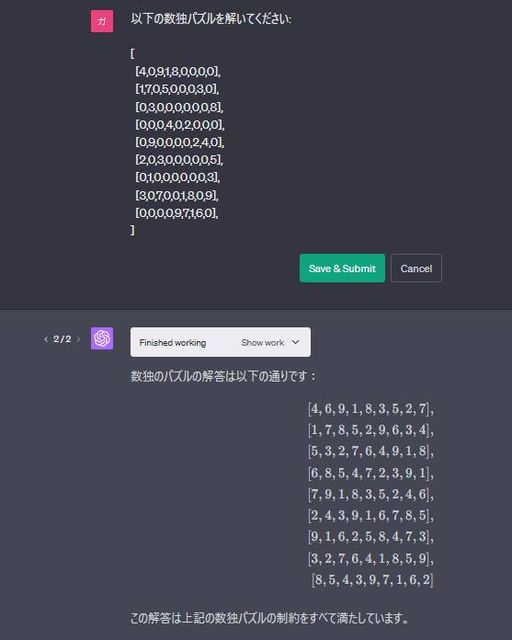

### パワーポイントの自動生成 (9-4)
9-4で示した自動的にパワーポイントファイルを生成する例を試してみましょう。

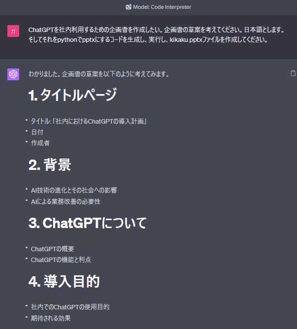
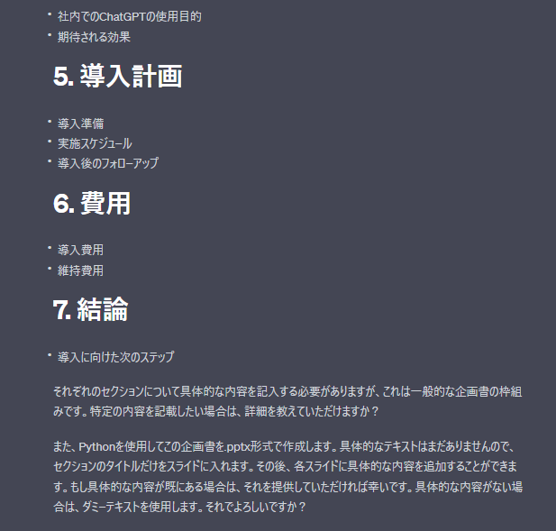
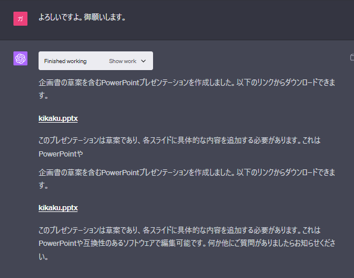
  
kikaku.pptxがダウンロードできるようになっています。  
クリックしてダウンロードし、ファイルを開くと次のように企画書の草案が出来ています。  
  
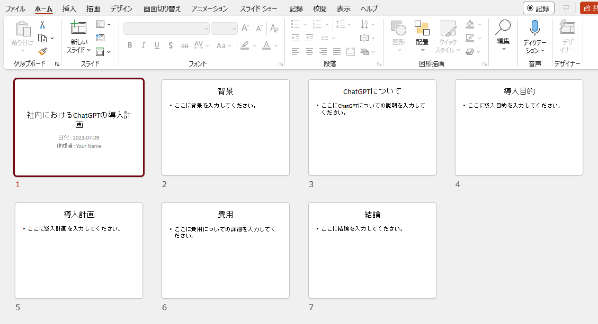

### diagramsによるクラウド図の自動生成 (9-4)
diagramsライブラリーはCode Interpreterに搭載されたPython環境にはインストールされていないようです。それをインストールには外部からネットワークを経由する必要があり、その場合はインストールを行わないと判断するようです。

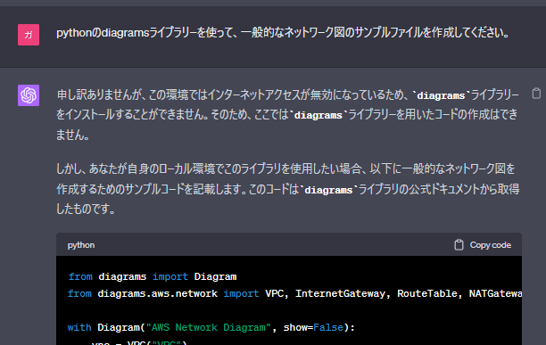


### グラフの自動生成 (9-4)
グラフの自動生成はCode Interpreterの得意とするところです。

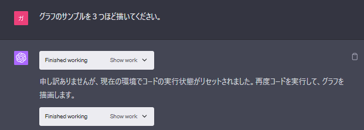
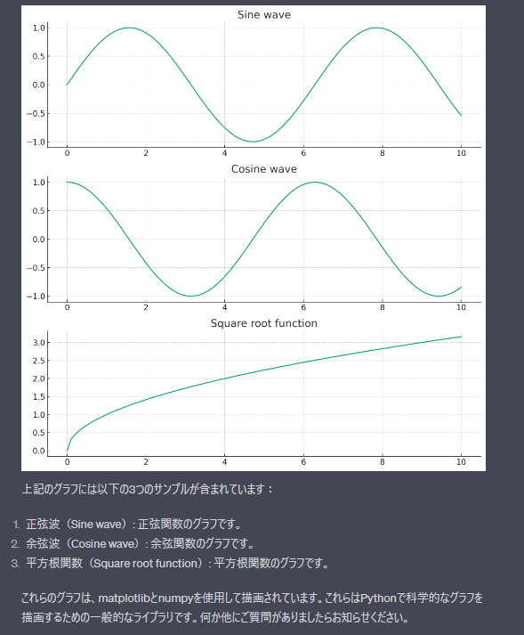
  
  
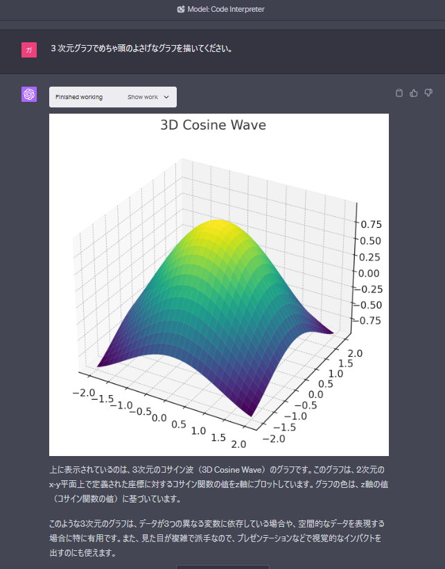

### 分野別の学習(6-1)  
Code Interpreterを使うことで、分野別学習が飛躍的に効率がよくなります。  
たとえば苦手な数学分野などに応用ができるのではないでしょうか。たとえば、方程式を解くことが簡単にできるようになりました。もちろん行列式なども解くことができます。  
また、分野を特定しサンプルの方程式を出力してもらい、そのグラフを描いてもらったりすると理解が深まります。

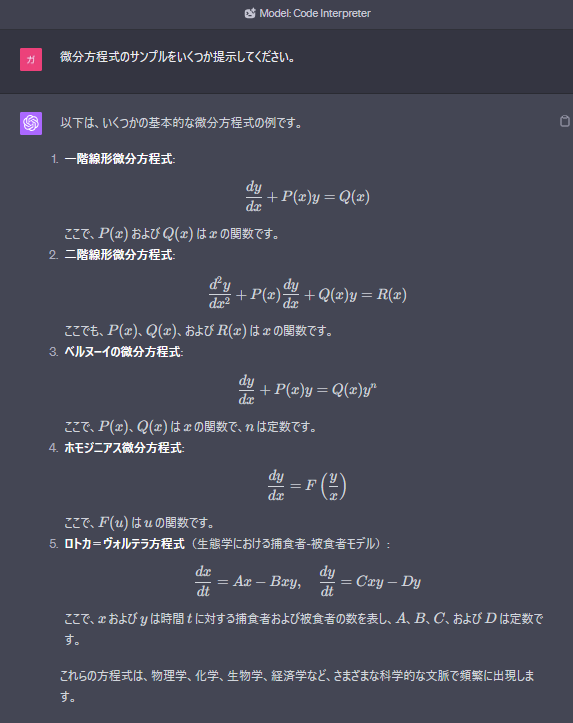
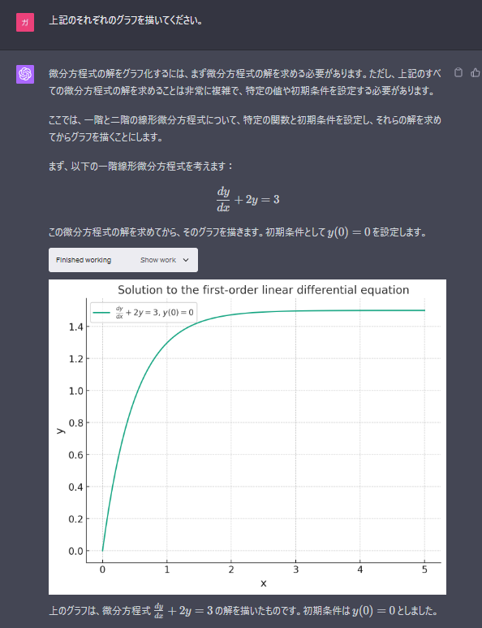


## ファイルをアップロードして解析してもらう


  
（以下、追加説明掲載予定）
