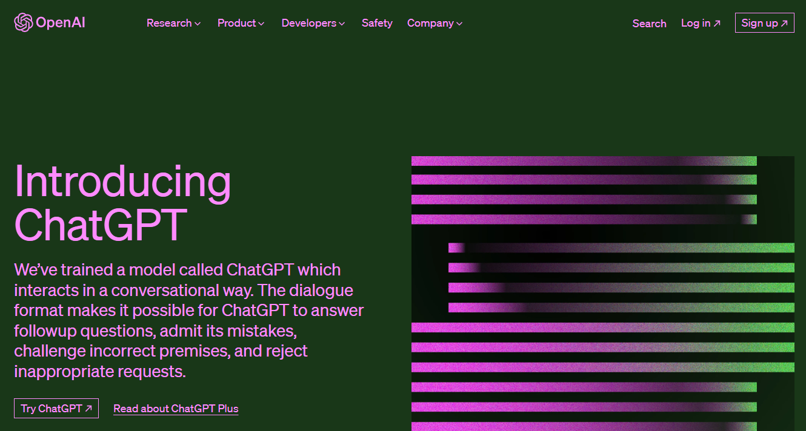
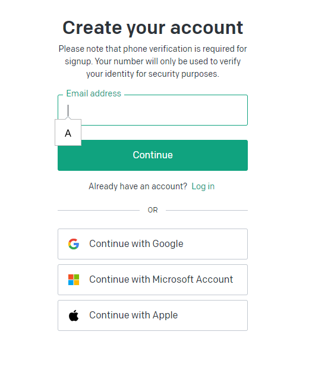
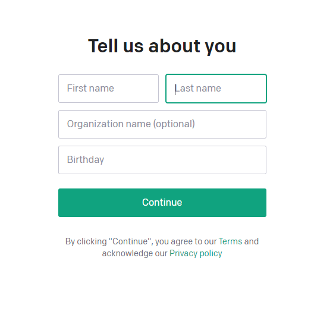
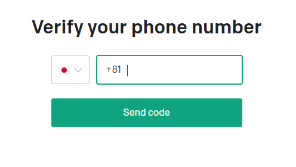
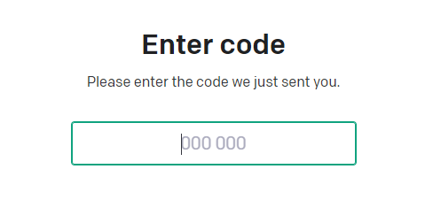
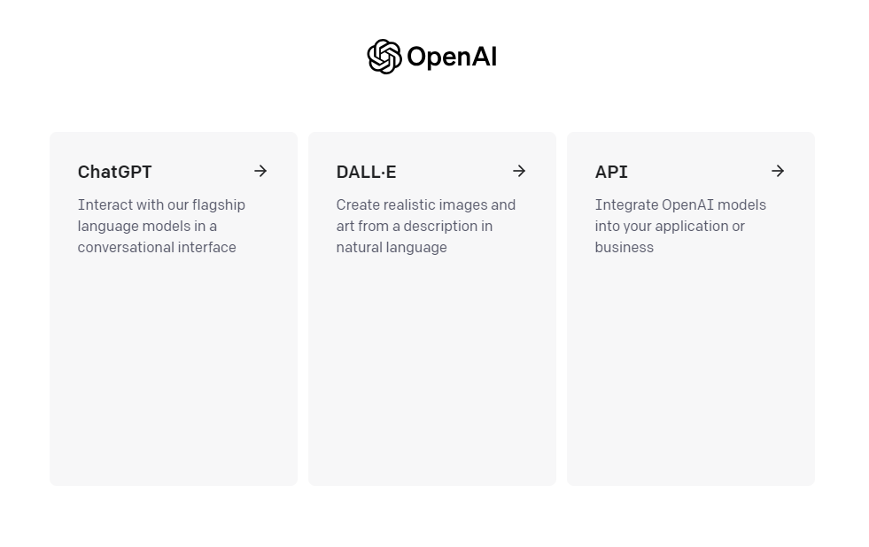
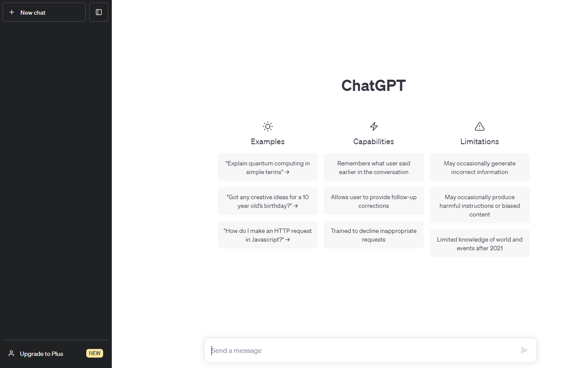
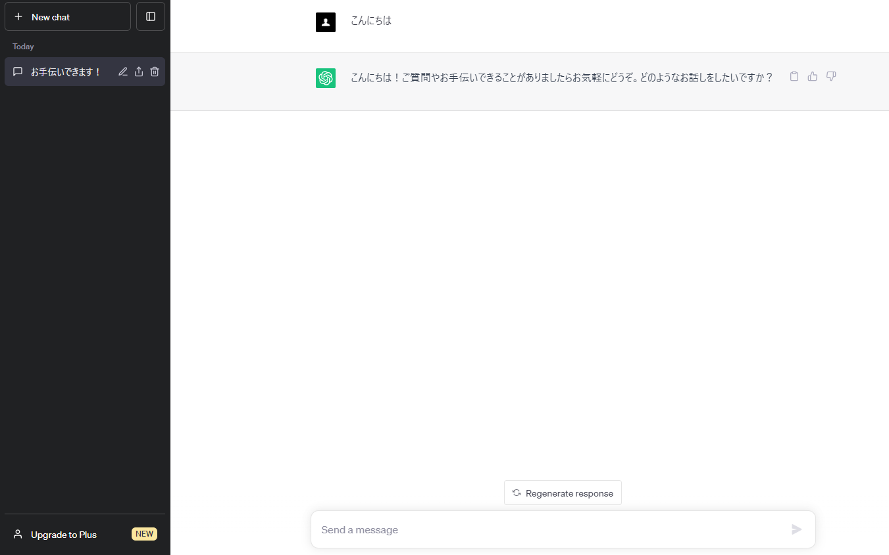
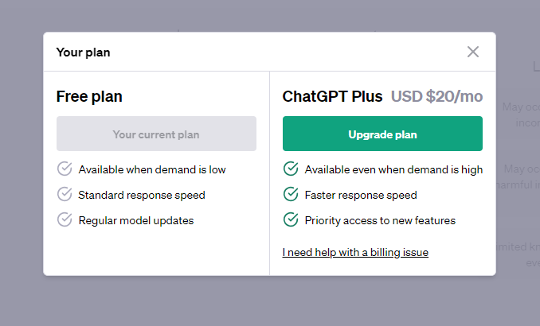
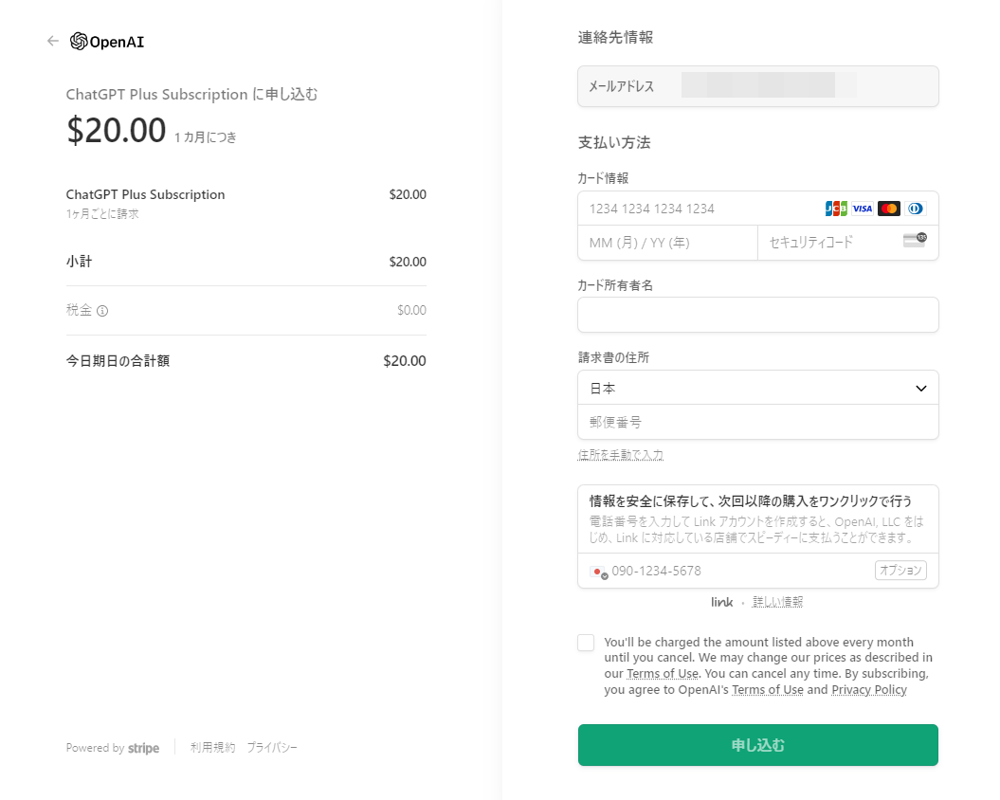

ここにChatGPTのサインアップの方法やPlusへのアップグレードなどについて書きます。

## サインアップ方法
Open AIのサイトにアクセスします。まだアカウントがない方の場合は次のような画面になります。
画面右上の［Sign Up］をクリックしてください。  
  

アカウント作成の画面が表示されます。GoogleアカウントやMicrosoftアカウントを持っている場合、それを使うとスムーズに登録できます。
もちろんE-Mailでも登録できます。お好きな方法でアカウントを作成してください。

名前と誕生日などの入力を求められるので入力し、［Continue］をクリックします。

電話番号の確認のためスマホの番号を入力します。

ショートメールで送られてきた認証コードを入力します。

次のような画面が表示されたら、ChatGPTを選んでください。

ChatGPTと会話ができるようになりました。
画面下の入力欄に質問などを入力してください。

これでChatGPTと自由に会話できるようになりました。
楽しんでください。

## Plusへのアップグレード方法

チャット画面下の［Upgrade to Plus］をクリックしてください。  
次のようにアップグレードを選択するポップアップウィンドウが表示されます。  
Upgrade planをクリックしてください。

クレジットカードなどの登録画面が表示されます。  
よく確認して申し込みます。

