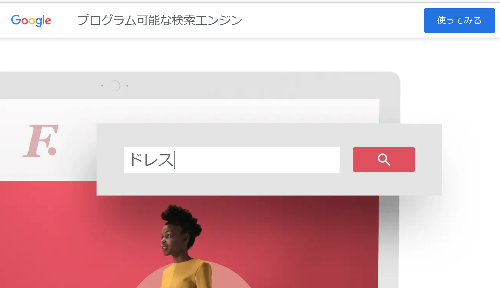
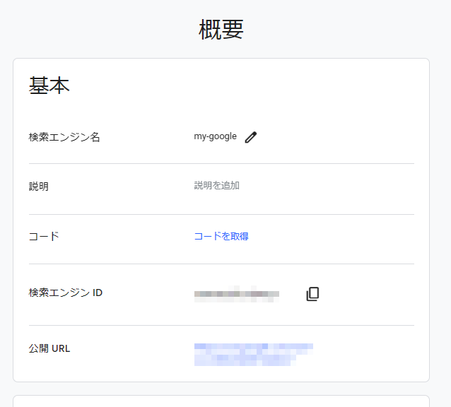
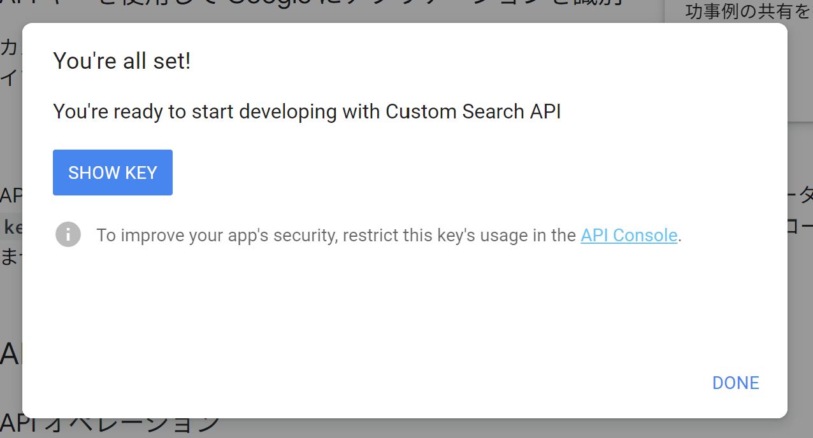

# Google Search のAPIーKEYの取得について

①[プログラム可能な検索エンジン](https://programmablesearchengine.google.com/)のページを開き「使ってみる」をクリックします。アカウント入力を求められたら入力して先に進みます。

②自分が使用する検索エンジンを作成します。名前はなんでもいいのでお好きな検索エンジン名を入力してください。検索の対象は「ウェブ全体を検索」を選んでください。「私はロボットではありません」を選ぶと「作成」が有効になります。「作成」をクリックしてください。

③次のような画面がでたら検索エンジンが作成されたことになります。

④「カスタマイズ」を選んでください。次の画面が表示されます。検索エンジンIDをメモしておいてください。

⑤Custom Search JSON APIの「開始する」をクリックしてください。

⑥すると次の画面のAPIの説明ページが表示されますので、

⑧次のように表示されたら「SHOW KEY」をクリックします。API KEYが表示されますのでそれコピーして保存してください。

以上の手順で取得した「検索エンジンID」と「API KEY」で検索ツールを使用することができます。

