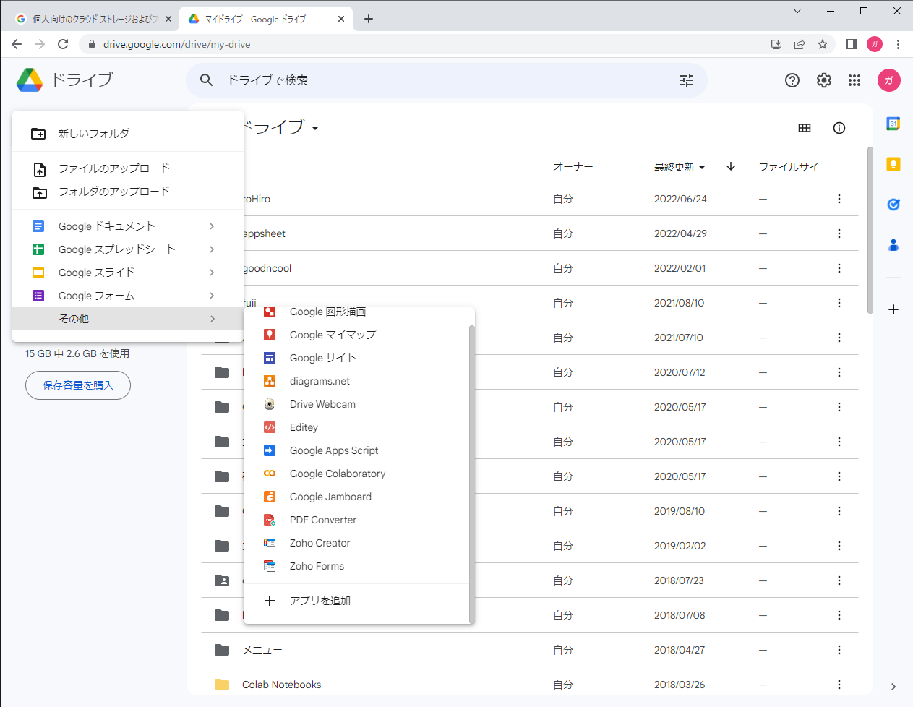
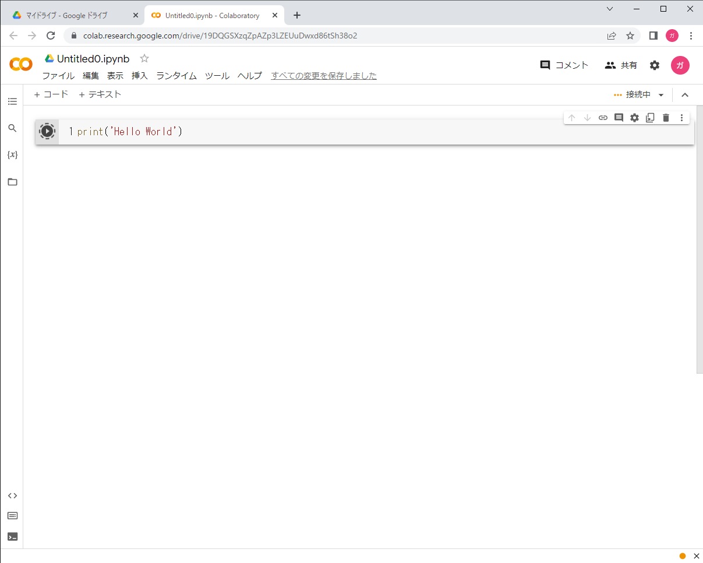
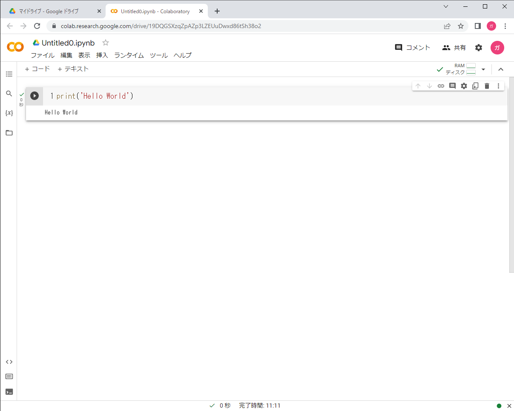
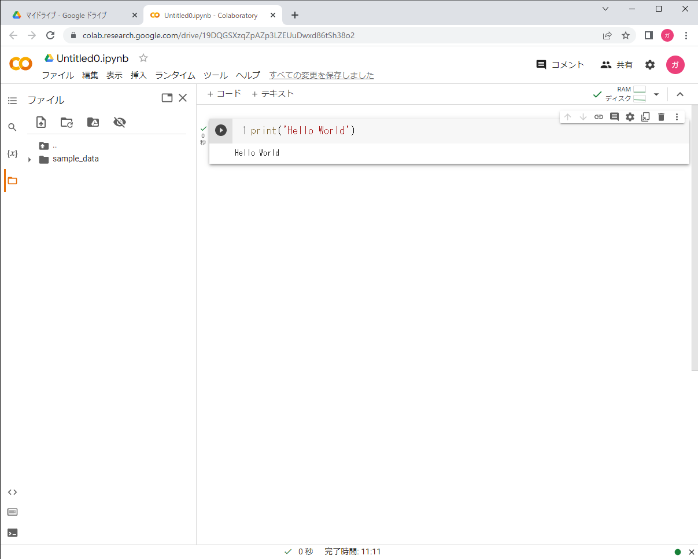

# Google Colaboを使う準備

Googleのトップページを開きます。

右端のアプリアイコン→[ドライブ]をクリックします。

はじめての方は下のような画面になるので、［ドライブを開く］をクリックします。

Googleのログイン画面が表示されるので、アカウントを入力して、［次へ］をクリック。

さらに、パスワード画面でパスワードを入力し、［次へ］をクリック。

2段階認証プロセスの画面が表示されたら、ショートメールで送られてきた認証コードを入力し、［次へ］をクリック

ドライブの画面が表示されます。初めての方はこの画面のリストは空になっていると思います。

［+新規］ボタンをクリックすると、次のようなコンテキストメニューが表示されます。その他を選ぶと右下のようなメニューが出てきますので、初めての方は、［+アプリを追加］を選んでください。

すると下のようなアプリ選択のメニューが表示されます。検索欄で「Colabo」と入力してください。Googlelaboratoryというアプリが見つかりましたら、それをクリックしてください。

次のような画面が表示されるので、セルにprint(’Hello World’)と入力し、黒丸矢印ボタンをおしてください。

最初の実行は時間がかかりますが、少し待つと次のようにプログラムが実行され結果が表示されます。以上でpythonプログラムが実行できる準備が整いました。

ちなみに左端のメニューのフォルダーアイコンを押してみると、スライダーが開きます。ここでファイルをアップロードしたり、ダウンロードが可能です。ファイルを扱うプログラムはこのディレクトリを参照しますので、ここでファイルの入出力が可能になります。

